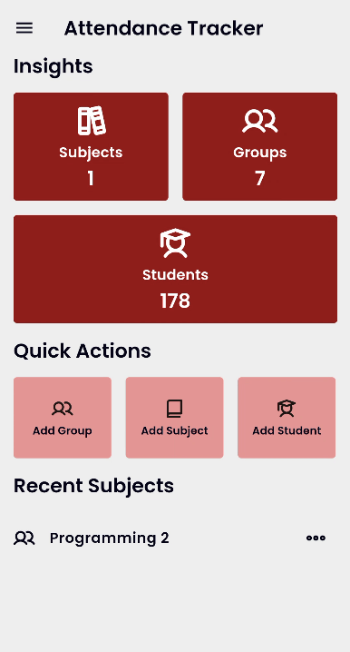
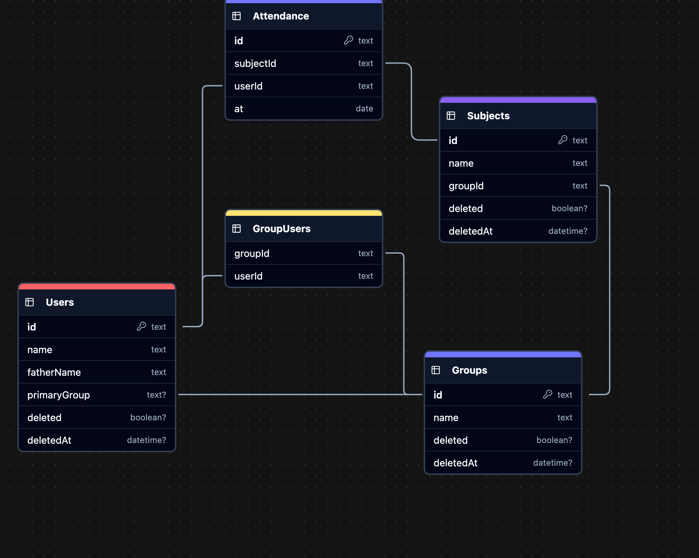

# Attendance Tracker

A Flutter application designed to simplify attendance tracking with QR code integration and comprehensive reporting features.

## About

Attendance Tracker is an open-source Flutter application designed for educational institutions to simplify attendance management. The app follows a hierarchical structure with groups, subjects, and students, allowing for flexible organization.

## Features
- Linear group management system
- QR code generation for student identification
- Camera-based attendance tracking
- PDF report generation with QR codes
- Subject-wise attendance reporting
- Excel export functionality
- Database import/export capabilities
- Bulk operation support

## Screenshot



## Database Diagram



## How to Use

### Basic Navigation
1. **Home Screen**: Access groups, subjects, students, and quick actions
2. **Groups**: Create and manage student groups
3. **Subjects**: Create subjects and track attendance for each
4. **Students**: Add students individually or import from Excel

### Taking Attendance in Detail

#### Understanding Key Terms
- **Group**: A collection of students (e.g., a class, department, or section)
- **Subject**: A course or class associated with a specific group
- **Attendance Session**: A record of student presence for a specific subject on a particular date

#### Methods for Taking Attendance

##### 1. QR Code Scanner Method
1. Navigate to a subject from the subjects list
2. Tap "Take Attendance with QR" option
3. The camera will open with a QR scanner
4. Students show their ID cards or QR codes (generated from the app)
5. When scanned:
   - The student name appears on screen
   - Toggle "Auto Save" to automatically record attendance when scanning
   - Without Auto Save, you can review scanned students and save in bulk

##### 2. Manual Attendance Method
1. Navigate to a subject
2. Tap "View Attendance"
3. You'll see a list of all students in the associated group
4. To mark attendance:
   - For individual students: Tap the menu (three dots) next to a student name and select "Add Attendance"
   - For multiple students: Enable selection mode, select students, and use the floating action button to mark attendance
5. Select the date for the attendance record

#### How Groups Affect Attendance
- Each subject is associated with a primary group
- Students can belong to multiple groups (primary and secondary)
- When taking attendance for a subject:
  - All students from the subject's primary group are available
  - Students from other groups who have been added to this group are also available
  - The app filters the student list based on group membership
- When viewing attendance reports:
  - You can filter by specific groups to see attendance for subsets of students
  - This allows for tracking attendance across different organizational structures


## Getting Started

```bash
# Clone the repository
git clone https://github.com/mahmoudmahm00d/attendance-tracker.git

# Navigate to project directory
cd attendance-tracker

# Install dependencies
flutter pub get

# Run the application
flutter run
```

## Requirements

- Flutter 3.0 or higher
- Android SDK 21+
